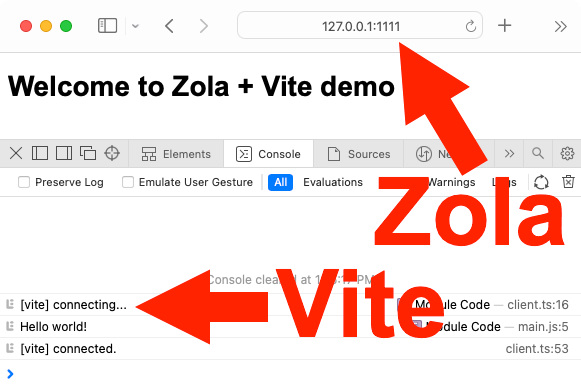

# Zola + Vite demo

This is a minimal working demo showing how you can neatly wire up [Zola](https://www.getzola.org/) with [Vite](https://vitejs.dev/) with very few dependencies.

- Zola is a simple and clever static site generator that uses [Tera](https://tera.netlify.app/) template engine with Jinja2/Twig-like syntax.
- Vite is a frontend build tool similar to Webpack, but easier to configure.

Please note that this is **NOT** a starter project or a boilerplate.

In this demo:
- Zola is responsible for HTML processing, Vite is responsible for JS and SASS processing. If you prefer Zola to process SASS instead of Vite, it’s trivial to configure that ([see Zola docs](https://www.getzola.org/documentation/content/sass/) and my comment in [main.js](https://github.com/EugeneDae/zola-vite-demo/blob/master/js/main.js)).
- Zola and Vite development servers run alongside.
- Hot reload works for HTML, JS, SASS code.
- Commands are available via `npm run` (see [package.json](https://github.com/EugeneDae/zola-vite-demo/blob/master/package.json)).
- Production builds are minificated: Zola minifies HTML, Vite minifies JS and CSS.

## How to use
1. Clone the repo and `cd` into the directory.
2. Run `npm install` to install dependencies.
3. Run `npm run dev` to run Zola and Vite dev servers.
4. Open [http://127.0.0.1:1111/](http://127.0.0.1:1111/) in your browser. You should see a page that says “Welcome to Zola + Vite demo” and `Hello world!` in the browser console.
5. Make some changes to `templates/index.html` OR `js/main.js` OR `sass/main.scss`. The page at [http://127.0.0.1:1111/](http://127.0.0.1:1111/) should update instantly with your changes reflected on it.
8. Run `npm run build` to build for production use (files will go to `public/` directory).

## Known issues

1. I haven't tested the demo on Windows.
2. If http://localhost:3000/@vite/client gives you 404, you need to open http://127.0.0.1:1111/ first. If it still doesn’t work, see [this](https://github.com/vitejs/vite/discussions/2978).

## Suggestions, questions?

Just [open an issue](https://github.com/EugeneDae/zola-vite-demo/issues). Please note that issues unrelated to the purpose of this repository will be marked as closed.
